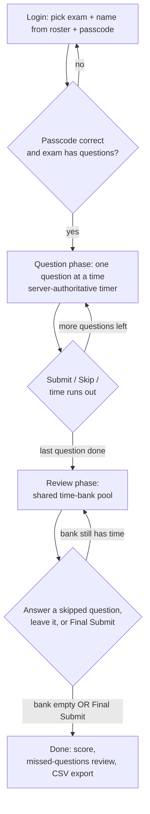
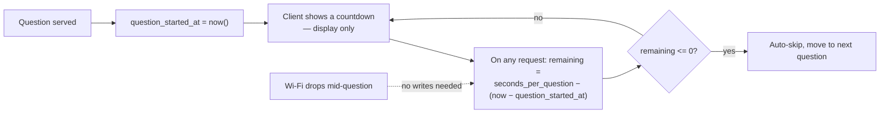
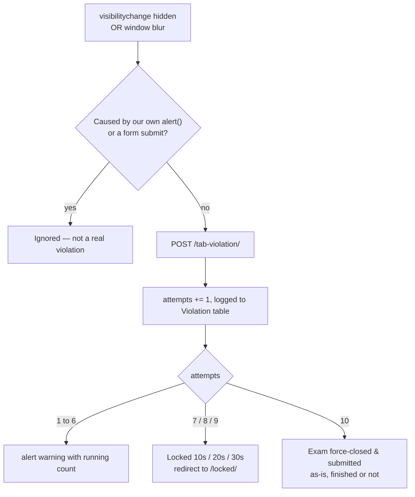
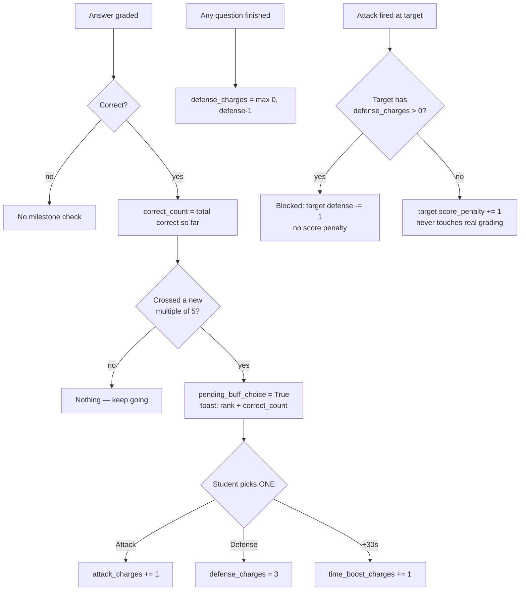

# Anti-Cheat Exam App

A server-authoritative, one-question-at-a-time classroom exam system built
with **Django + Tailwind + SQLite**, per `plan.md`.

- ✅ Server owns the timer — a dropped Wi-Fi connection can't buy extra time
- ✅ Layered anti-cheat — tab-switch escalation, copy/paste logging, redundant client-side guards
- ✅ Optional **Game Mode** — buffs, attacks, and a live leaderboard on top of real grading
- ✅ Live teacher dashboard + one-click CSV export
- ✅ Tested end-to-end with the Django test client (see [Smoke-tested during the build](#smoke-tested-during-the-build-django-test-client))

## Table of contents

- [Flowcharts](#flowcharts)
- [Quickstart](#quickstart)
  - [Exam JSON format](#exam-json-format)
  - [Bulk student roster import](#bulk-student-roster-import)
  - [Docker](#docker)
  - [Styling uses the Tailwind CDN](#styling-uses-the-tailwind-cdn)
- [Newer additions (this round)](#newer-additions-this-round)
- [Game Mode + image support + polish (latest round)](#game-mode--image-support--polish-latest-round)
- [What's implemented](#whats-implemented)
- [Smoke-tested during the build](#smoke-tested-during-the-build-django-test-client)
- [Notes before a real exam](#notes--things-to-double-check-before-a-real-exam)

## Flowcharts

These render automatically on GitHub/most Markdown viewers (Mermaid). If
your viewer doesn't support Mermaid, the code blocks are still readable as
plain step-by-step diagrams.

### Student exam flow



### Server-authoritative timer (why disconnects are safe)



### Tab-switch / anti-cheat escalation



### Game Mode: buff milestone + attack



## Quickstart

```bash
python3 -m venv venv
venv/Scripts/activate                                   # optional but recommended
pip install -r requirements.txt

python3 manage.py migrate
python3 manage.py createsuperuser                      # this account is your first "teacher"

python3 manage.py import_exam data/sampletopic.json --teacher <your_username>
# (omit --teacher to default to the first superuser)

python3 manage.py runserver 0.0.0.0:8000                # 0.0.0.0 so classmates on the LAN can reach it
```

Then:
1. Go to `http://<your-ip>:8000/admin/`, log in, open **Exams**, and tick
   **is_active** on the imported exam (or select it and use the *Activate
   selected exams* action). Exams import as inactive by default.
2. On the same exam's edit page, use the **Import Roster** button (top
   right) to bulk-add students from a `.txt` or `.json` file — see
   "Bulk student roster import" below — or add them one by one in the
   **Students** inline. There's no student self-registration — you
   control the roster and who can get in.
3. Students go to `http://<your-ip>:8000/`, pick their exam, pick their
   name from the roster dropdown, and type the passcode you gave them.
4. You can watch them live at
   `http://<your-ip>:8000/teacher/monitor/<exam_id>/` (exam id shown in the
   admin list).
5. When done, go back to the Exams list in admin, select the exam, and use
   **Export results to CSV**.

You can also import more exams straight from the admin UI: **Exams → Import
JSON** (top-right button on the changelist page), using the same JSON shape
as `data/sampletopic.json`.

### Bulk student roster import

Open an exam in admin and click **Import Roster** (next to Import JSON, on
the exam's own edit page — it's per-exam since rosters are per-exam).
Upload either:

**`.txt`** — one name per line:
```
Doe, Jane
Dela Cruz, Juan
Alonso, Martin
Reyes, Juanito
Doe, John
```
Passcodes are auto-generated (random 6-digit numbers) since none are given
— the import result page shows you every generated code so you can copy
them out to distribute. To set your own codes instead, add a `|`:
```
Doe, Jane|482113
Dela Cruz, Juan|990201
```

**`.json`** — a plain list of names (auto-generated codes), or a list of
`{"name": ..., "passcode": ...}` objects for explicit codes:
```json
["Doe, Jane", "Dela Cruz, Juan"]
```
```json
[{"name": "Doe, Jane", "passcode": "482113"}, {"name": "Dela Cruz, Juan"}]
```

**`.md`** — same rules as `.txt`, but markdown-aware: leading list markers
(`-`, `*`, `1.`) are stripped, headings (`#...`) and horizontal rules
(`---`) are skipped. So a normal markdown bullet-list roster just works:
```markdown
# Class 10A
- Doe, Jane
- Dela Cruz, Juan|990201
1. Alonso, Martin
```

Re-uploading the same file is safe — existing students (same name, same
exam) are left alone (their passcode isn't regenerated) unless the file
gives them an explicit new code.

You can also change any student's passcode any time, or toggle **Game
Mode** on/off per exam, directly from the admin list pages — both
`passcode` (Students) and `game_mode` (Exams) are inline-editable columns,
no need to open each record. There's also a **Toggle Game Mode** bulk
action on the Exams list for flipping several at once.

### Exam JSON format

Exams are imported via `manage.py import_exam <file> --teacher <username>` or
the admin's **Import JSON** button. Here's the shape, trimmed to one
question of each type — see `data/sia_exam_sample.json` for a full
20-question example:

```json
{
  "subject": "sia_exam_m1_m2",
  "title": "System Integration & Architecture — Comprehensive Exam",
  "secondsPerQuestion": 45,
  "hintsEnabled": true,
  "gameMode": true,
  "questions": [
    {
      "id": "q1",
      "module": "M1",
      "type": "multiple_choice",
      "text": "Which enterprise system unifies diverse business functions into a single system?",
      "options": ["TPS", "ERP", "Expert System", "DSS"],
      "answerIndex": 1,
      "imageLink": "https://example.com/photo.jpg",
      "hint": "It's often called the crown jewel of system integration."
    },
    {
      "id": "q7",
      "module": "M1",
      "type": "true_false",
      "text": "Systems integration only addresses technical software engineering.",
      "options": ["True", "False"],
      "answerIndex": 1,
      "imageLink": null,
      "hint": "Recall the 'Behavioral Change' benefit."
    }
  ]
}
```

**Top level:**
- `subject` *(string, required)* — short internal slug/id for the exam
- `title` *(string, required)* — display name shown to students and admin
- `secondsPerQuestion` *(integer, required)* — base per-question time bank
- `hintsEnabled` *(boolean, optional, default `false`)* — shows the `hint` field to students
- `gameMode` *(boolean, optional, default `false`)* — turns on buffs/attacks/leaderboard
- `questions` *(array, required)* — list of question objects, in order

**Each question:**
- `id` *(string, required)* — unique within the exam, e.g. `"q1"`
- `module` *(string, optional)* — free-form grouping label, e.g. `"M1"`
- `type` *(string, required)* — `multiple_choice`, `true_false`, or `identification`
- `text` *(string, required)* — the question prompt
- `options` *(array of strings)* — choice labels; `true_false` is always `["True", "False"]`; not used for `identification`
- `answerIndex` *(integer)* — zero-based index into `options` for the correct choice; not used for `identification`
- `imageLink` *(string or `null`, optional)* — image shown with the question
- `hint` *(string, optional)* — only shown if `hintsEnabled` is `true`

For `identification` questions, swap `options`/`answerIndex` for a plain
`"answer"` string. Grading is case/whitespace-insensitive (`"PHP My Admin"`
and `"phpmyadmin"` both match), but genuine misspellings still fail.

> The older grouped-array schema (questions nested under per-module keys)
> still imports fine for backwards compatibility — but the flat
> `questions[]` shape above is the current recommended format.

### Docker

```bash
docker compose up --build
```
That builds the image (installing `requirements.txt`, which now includes
`whitenoise` and `gunicorn`, and running `collectstatic`), runs migrations
automatically on start (`docker-entrypoint.sh`), and serves the app on
`http://localhost:8000` via gunicorn, with the SQLite database persisted in
a named volume (`exam_data`) so it survives rebuilds.

Then create your teacher account inside the running container:
```bash
docker compose exec web python manage.py createsuperuser
```

Environment variables (set in `docker-compose.yml`, all optional):
- `DJANGO_DEBUG` — defaults to `False` in Docker (vs. `True` for local
  `manage.py runserver`, unchanged from before).
- `DJANGO_ALLOWED_HOSTS` — comma-separated, defaults to `*`.
- `DJANGO_SECRET_KEY` — set a real one if this ever leaves a closed LAN.
- `DJANGO_DB_PATH` — defaults to `/app/data/db.sqlite3`, matching the
  mounted volume; change both together if you move it.

I don't have Docker available in the environment I built this in, so I
couldn't literally run `docker build`/`docker compose up` — but I did
validate every step the container actually performs against the real app:
installed `whitenoise`+`gunicorn` from `requirements.txt`, ran
`collectstatic` with `DEBUG=False` (whitenoise's manifest storage needs
this to succeed at build time), booted the real WSGI app under gunicorn
and confirmed pages and static assets (including `pedro.gif`) serve
correctly, and ran `docker-entrypoint.sh` itself with a custom
`DJANGO_DB_PATH` to confirm migrations apply and the database file lands
in the right place. Worth a real `docker compose up` on your end as a
final check, but the pieces it depends on are confirmed working.

### Styling uses the Tailwind CDN

`base.html` pulls in `@tailwindcss/browser@4` from `cdn.jsdelivr.net` and
defines the emerald palette inline via a `<style type="text/tailwindcss">`
block with `@theme`. No Node/npm tooling, no build step, no `package.json`
— it's plain Django + a CDN script, matching the rest of the stack.

**Trade-off to know about:** this means the app needs internet access to
load its styling (the CDN script itself). If you're deploying on a school
LAN with no outside internet, the pages will still work but will render
unstyled until that script loads. If that ever becomes a problem, the fix
is to self-host a built Tailwind CSS file instead of the CDN script — just
say the word and it can be swapped back.

## Newer additions (this round)

<details>
<summary>Expand changelog</summary>

- **Per-student question randomization**: each student gets their own
  shuffled question order (`Submission.question_order`), set once at first
  login. Makes "question 5 is X" harder to share between students taking
  the same exam. All the timer/auto-skip/review logic now resolves
  questions through this per-student order (`views.py::_get_ordered_questions`)
  instead of the exam's fixed natural order.
- **Score summary shown after submission**: the "Exam Submitted" screen
  now shows score / total, percentage, and questions answered
  (`views.py::_score_summary`), plus a note if tab-switch attempts were
  recorded.
- **Keyboard shortcuts** on the question/review screens: number keys
  (1-9) or letter keys (a, b, c...) pick a choice, Enter submits,
  Ctrl/Cmd+S skips. Typing in the identification text box is left alone
  except Enter. Doesn't interfere with the anti-cheat listeners — added as
  its own independent block in `exam.js`.
- **Log-only violation reporting** via a new `/report-violation/` endpoint
  and `reportViolation`'s sibling `logViolation` in `exam.js`:
  - Copy attempts log the actual selected text (truncated to 200 chars) so
    a teacher can see what was being copied, not just that a copy happened.
  - Paste and cut attempts are logged too.
  - Prolonged idle (30s with no mouse/keyboard/touch activity) is logged.
  - **Deliberately separate from the tab-switch escalation** — these are
    informational only and do NOT count toward the 6-warning /
    3-lock / auto-close schedule, which stays scoped strictly to
    tab-switch/window-blur as originally specified. Verified: hitting
    `/report-violation/` three times mid-exam left `tab_attempts` at 0 and
    the very next real tab-switch still started at attempt 1, not 4.
- **Live teacher monitor** now shows a Violations column (total count
  across all violation types, not just tab-switch) with a pulsing dot for
  recent activity in the last 30s, plus a live-ranked **Score** column
  (correct/answered out of the exam's total) — rows are sorted most-correct
  first (ties broken by answered-so-far) on every 5s poll, so the class
  ranking updates in real time as students progress.
- **CSV export** gained `Score %`, `Total Violations`,
  `Most Common Violation Type`, and `Suspiciously Fast Answers (<3s)`
  columns — the last one flags answers submitted in under 3 seconds as a
  signal worth a manual look, not an automatic penalty.
- Answers now record `time_spent_seconds` (server-computed elapsed time),
  which powers the fast-answer CSV flag above.

</details>

## Game Mode + image support + polish (latest round)

<details>
<summary>Expand changelog</summary>

- **Question images**: `Question.image_url`, shown in a "3D glass emerald"
  frame, laid out **side-by-side with the question text on desktop**
  (`md:flex-row` — image left, text/form right) and stacked vertically on
  mobile, since that already looked good as-is. The importer supports the
  newer flat `questions[]` JSON schema (with `imageLink`, `module`, `type`,
  and a top-level `gameMode` flag) *alongside* the original grouped-array
  schema — both work, auto-detected by the presence of a `"questions"`
  key. See `data/sia_exam_sample.json`.
- **Holographic-emerald theme**: `.glass` surfaces now carry a slow,
  low-opacity iridescent sheen (`::after` with a moving `screen`-blended
  gradient), and an animated `.holo-edge` / `.holo-btn` gradient (emerald →
  cyan → violet) accents primary buttons and buff highlights. I couldn't
  visually proof this in a real browser from here (no browser available in
  this environment) — it's built from solid CSS techniques and checked for
  correct markup/class output, but take a look and tell me if it needs
  tuning.
- **Game Mode is now skill-based, not attempt-based**: a buff is earned
  every **5th correct answer** (not every 5th question attempted — wrong
  or skipped answers don't count, matching "5 pts in 8 questions" from the
  spec). Verified: a pattern of correct/correct/**wrong**/correct/correct/
  **correct**/skip/correct hits the milestone exactly on the 6th correct
  answer (question 8 overall), not the 5th question.
  - **The student picks ONE buff, not all three** — a persistent banner
    (`pending_buff_choice`) appears with three options and stays up until
    claimed via `/game/choose-buff/`. Verified: choosing "defense" grants
    only defense charges; attack/time-boost stay untouched, and you can't
    double-claim the same milestone.
  - **Defense** (nerfed from 5 → 3 charges per pick, per feedback) still
    decays by 1 on every question *finished* (answered, skipped, or
    auto-skipped) regardless of the correct-answer milestone — that part
    was unchanged.
  - **Attack** (⚔️) unchanged. **Time boost** (⏱️) is server-authoritative
    (same mechanism as the base countdown) and deliberately allowed to
    push remaining time *past* the exam's base `seconds_per_question` —
    stacking two +30s boosts on a 45s question reached 104s in testing.
    The countdown UI now visibly shows this "overboosted" state (timer
    text turns cyan, the progress bar goes holographic) instead of just
    looking like it topped out at 100%.
  - **Live leaderboard tab**, ranked by game score (correct − attack
    penalties), never touches real grading.
- **Missed-questions review + CSV export** on the done screen: every
  question the student got wrong or never answered, with their answer and
  the correct one, plus a client-side "Export CSV" button (built from the
  same data already on the page, no extra server round-trip).
- **Loading overlay** using `pedro.gif`: shown right when the login form
  is submitted, and as a 2.5s entrance flourish on the done screen
  (`templates/exam.html`, easy to retune — it's a single `setTimeout`).
  The gif's black background is removed via `mix-blend-mode: screen`
  inside a glowing circular frame, so it blends into the dark theme
  instead of showing a black box.
- **Sound effects** for checkpoints, buff claims, attacks (hit vs.
  blocked), and time-boosts — synthesized in-browser via the Web Audio API
  (short generated tones), not external audio files, so there's nothing to
  host or license. Note: browsers block audio before the first user
  gesture on a page, so the very first sound (e.g. a checkpoint toast right
  on page load) may be silent until the student clicks/taps something —
  that's a browser policy, not a bug here.

**Design call worth knowing about:** attack penalties can push a student's
game score below zero (not floored), so relative ranking stays meaningful
even after multiple hits. That's a single, clearly isolated line in
`views.py::_effective_score` to change if you'd rather floor it at 0.

</details>

## What's implemented

The full feature set, mapped to where it lives in the code:

- Roster-based sign-in: students never self-register. Teachers add each
  student's name + a passcode per exam in Django Admin (inline on the Exam
  page, or the standalone Student list). The login page is two dropdowns
  (exam, then name) plus a passcode field — see `core/models.py::Student`
  and `core/views.py::login_view`.
- Django models: `Exam`, `Question`, `Choice`, `Student`, `Submission`,
  `Answer` (incl. `question_started_at` and `last_heartbeat` as the plan
  specifies).
- JSON importer (`core/services/importer.py` + `manage.py import_exam` +
  an admin upload form) supporting `multipleChoice`, `boolean`, and
  `identification` question types.
- One-question-per-screen delivery — only the current question is ever sent
  to the browser.
- Server-authoritative adaptive time bank: every remaining-time calculation
  is `seconds_per_question - (now - question_started_at)`, recomputed fresh
  on every request. The client only displays a countdown; it never decides
  when time is up.
- Disconnect-safe by construction: reconnecting just re-derives `elapsed`
  from the same timestamp, so a dropped Wi-Fi connection resumes with
  correct remaining time (or a correct auto-skip if time ran out during the
  gap) with no extra reconciliation logic.
- Auto-skip on timeout, manual "Skip for Now", and a shared review-phase
  time bank that pools unused seconds and lets students revisit
  skipped/unanswered questions before final submission.
- Identification-answer grading matches the plan's normalization rules
  exactly (case/whitespace-insensitive, but genuine misspellings are marked
  wrong — see `core/utils/grading.py`).
- Tab-switch policy: 1–6 warnings, 7th = 10s lock, 8th = 20s lock, 9th =
  30s lock, 10th = exam auto-closed and submitted as-is — regardless of
  whether the student had finished all questions
  (`core/views.py::tab_violation`, enforced server-side). The student sees
  an `alert()` on **every** attempt (1 through 10), not just once locked,
  so they always know exactly where they stand.
- Anti-cheat is layered, redundant on purpose:
  - `document.addEventListener('copy'|'cut'|'contextmenu'|'keydown', ...)`
    in `static/js/exam.js`, registered first and independently of the
    timer/form logic in that file, so a bug elsewhere in the script can't
    silently disable them.
  - **Inline HTML attributes** (`oncopy="return false"`, `oncut`,
    `onpaste`, `oncontextmenu`, plus a `select-none` body class) directly
    on `<body>` in `exam.html`/`review.html` — these work even if the
    external `exam.js` file fails to load or errors out entirely, since
    they're compiled by the browser at parse time, independent of any
    `<script>` tag.
  - Tab-switch/away detection uses both `visibilitychange` and a
    `window blur` fallback, each posting `{type: "tab-switch"|"window-blur"}`
    as JSON to `/tab-violation/` via `reportViolation(type)`. Every
    violation is also written to a `Violation` audit-log row
    (`submission`, `violation_type`, `created_at`) — visible read-only in
    Django Admin — in addition to the running `Submission.tab_attempts`
    counter used for the lock/close schedule.
  - Verified by simulating copy/right-click/F12/tab-switch events against
    the real script in a headless DOM (jsdom), and separately by hitting
    `/tab-violation/` over real HTTP with CSRF enforcement turned on and a
    JSON body — exactly how a browser's `fetch()` sends it — confirming
    all 10 attempts escalate correctly and are logged.
  - These remain deterrents, not guarantees — no page-level JS can fully
    block a determined student from opening devtools via the browser's
    own menu — matching the plan's framing.
- Live teacher dashboard (`/teacher/monitor/<exam_id>/`) polling every 5s,
  separate from Django Admin, with stale-connection highlighting driven by
  `last_heartbeat`.
- Django Admin: JSON import, activate/deactivate/archive actions, CSV
  export (filename includes an export timestamp, e.g.
  `exam_results_20260718_061427.csv`), and normal teacher/staff account
  management (multiple teachers
  supported via ordinary Django staff users).
- Emerald glassmorphism theme via the Tailwind v4 CDN script (no build
  step) matching the plan's palette, applied across login/exam/review/
  locked/teacher-monitor screens.

## Smoke-tested during the build (Django test client)

<details>
<summary>Expand test log</summary>

- Full login → answer → skip → review → final-submit flow, 30/30 correctly
  graded on the sample exam.
- Simulated Wi-Fi drop (sleeping past a question's timeout with no
  requests in flight) → correct auto-skip on reconnect, no time-accuracy
  loss.
- Tab-switch escalation produced exactly the intended schedule: warnings on
  1–6, 10s lock on 7, 20s lock on 8, 30s lock on 9, auto-close (submitted
  as-is, finished or not) on 10.
- Per-student question randomization confirmed different from the exam's
  natural order, with full-length coverage (every question still shown
  exactly once), by walking a student's own `question_order` end to end.
- Log-only violations (copy/paste/idle) confirmed to record correctly
  without touching `tab_attempts` — a subsequent real tab-switch still
  started counting from 1.
- Keyboard shortcuts (number/letter choice selection, Enter-to-submit,
  Ctrl+S-to-skip) and copy-attempt detail logging verified via a headless
  DOM (jsdom) simulation of real key/copy events against the actual script.
- Game Mode: buff checkpoint (attack/defense/time-boost granted exactly at
  question 5), defense decay on the following question, attack
  blocked-vs-unblocked outcomes, and live leaderboard ranking all verified
  against the real backend. Caught and fixed a real sign error in the
  time-boost math during testing — it was *subtracting* 30s of remaining
  time instead of adding it (44s → 14s) until corrected (confirmed
  44s → 74s after the fix). The full Game Mode UI (checkpoint toast,
  leaderboard toggle, opponent picker + attack flow, time-boost reload
  guard) was verified in a headless DOM simulation of the real script.
  Both JSON schemas (grouped-array and the newer flat `questions[]` with
  images) were confirmed importing and running side by side.
- Skill-based buff milestone reconfirmed after the rework: a mixed
  correct/wrong/skip pattern hits the buff-choice trigger exactly on the
  6th correct answer (not the 6th question), and claiming one buff type
  leaves the other two untouched — verified against the real backend, plus
  the picker UI verified in a headless DOM simulation.
- Missed-questions review data confirmed against a real mixed-answer run
  (correct/wrong/skipped) — right count, right question text, right
  "your answer" vs. "correct answer" pairing, including unanswered
  questions showing "(no answer)".
- Identification normalization trace matches the plan exactly: "PHP My
  Admin" and "phpmyadmin" both match; "phpmyadmim" is correctly rejected.
- CSV export, Django Admin JSON import, and the live teacher dashboard JSON
  endpoint all verified.

</details>

## Notes / things to double check before a real exam

- `exam_system/settings.py` currently has `DEBUG = True` and
  `ALLOWED_HOSTS = ['*']` for easy LAN testing. For a real exam, consider
  setting `DEBUG = False` and restricting `ALLOWED_HOSTS` to your LAN
  subnet/hostnames.
- SQLite + Django's dev server (`runserver`) is fine for the target scale
  (~50 concurrent students on a school LAN) per the plan, but the dev
  server is single-threaded by default — for real use, run it with
  `runserver` and consider `--noreload`, or front it with a small WSGI
  server (e.g. `gunicorn` with a couple of workers) if you want real
  concurrency headroom.
- `SECRET_KEY` in `settings.py` is the Django-generated dev key — fine for
  a closed LAN, but swap it out if this ever leaves your classroom network.
